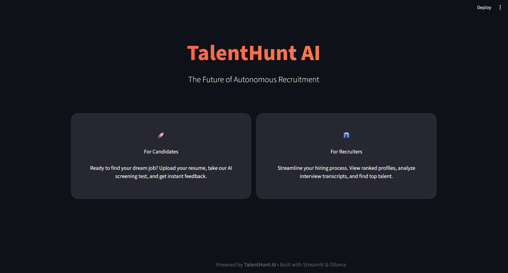
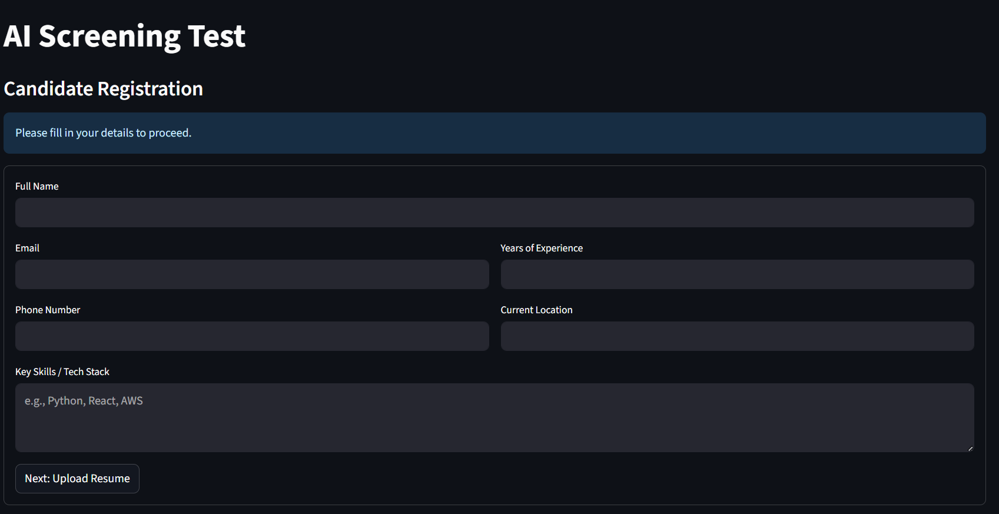
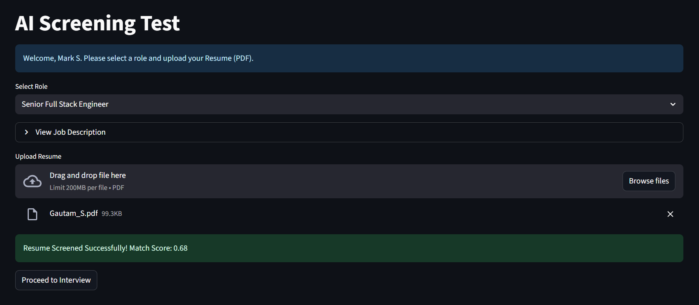
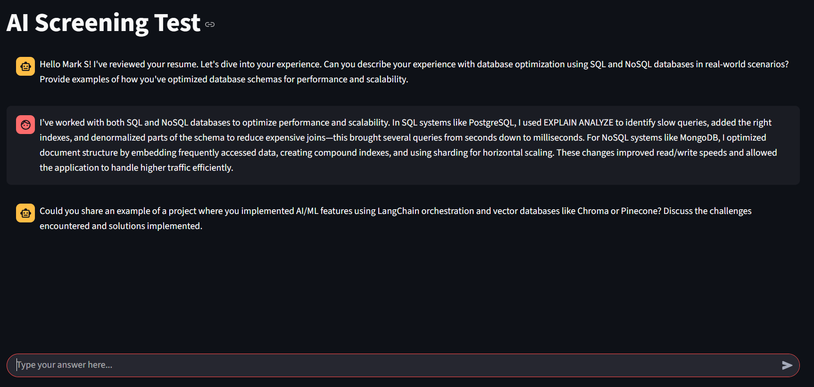
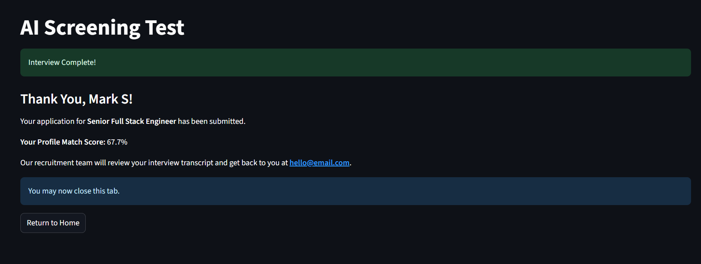

# TalentHunt AI

**TalentHunt AI** is an Autonomous AI Hiring System designed to streamline the recruitment process. It leverages **RAG (Retrieval-Augmented Generation)** and **Large Language Models (LLMs)** to screen resumes, conduct initial technical interviews, and rank candidates based on semantic fit.



## Key Features

- **Autonomous Screening:** Parses PDF resumes and calculates a **Semantic Match Score** against the Job Description using Vector Embeddings.
- **AI Interviewer:** Conducts dynamic, chat-based technical interviews using **Mistral 7B**. Questions are tailored to the candidate's resume gaps.
- **Multiple Roles:** Candidates can apply for various positions (e.g., Full Stack Engineer, Data Scientist).
- **Recruiter Dashboard:** A secure, password-protected dashboard for recruiters to view ranked candidates, interview transcripts, and AI summaries.
- **Premium UI/UX:** A modern, dark-themed interface with role-based navigation and a seamless candidate experience.

## System Architecture

The system uses a modular RAG pipeline to process resumes and conduct interviews.


## Tech Stack

- **Frontend:** Streamlit
- **LLM:** Ollama (Mistral 7B Instruct)
- **Embeddings:** Nomic Embed Text
- **Vector Store:** ChromaDB
- **Orchestration:** LangChain
- **Database:** SQLite

## Getting Started

### Prerequisites

1.  **Python 3.10+**
2.  **Ollama** installed and running locally.
    - Download from [ollama.com](https://ollama.com).
    - Pull the required models:
      ```bash
      ollama pull mistral:7b-instruct
      ollama pull nomic-embed-text
      ```

### Installation

1.  **Clone the repository:**

    ```bash
    git clone <repository-url>
    cd TalentHunt
    ```

2.  **Create and activate a virtual environment:**

    ```bash
    python -m venv .venv
    # Windows
    .venv\Scripts\activate
    # Mac/Linux
    source .venv/bin/activate
    ```

3.  **Install dependencies:**
    ```bash
    pip install -r requirements.txt
    ```

### Running the Application

1.  **Start the Streamlit app:**

    ```bash
    streamlit run app.py
    ```

2.  **Access the App:**
    Open your browser at `http://localhost:8501`.

## User Guide

### For Candidates

1.  **Landing Page:** Click **"Start Your Journey"**.
2.  **Register:** Enter your details (Name, Email, Skills).
    
3.  **Upload Resume:** Select a Role and Upload your PDF Resume.
    
4.  **AI Interview:** If your resume matches (> 40%), you will proceed to the interview.
    
5.  **Feedback:** Receive your **Match Score** immediately.
    

### For Recruiters

1.  **Login:** Access the dashboard with credentials (`admin@talenthunt.com` / `admin123`).
2.  **Dashboard:** View the **Leaderboard** of candidates ranked by score.
    
3.  **Deep Dive:** Expand any candidate to see their **Resume Summary**, **Interview Transcript**, and **Contact Details**.
